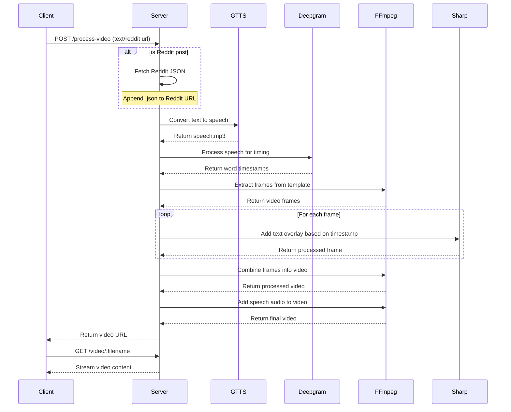

# Video Content Generator

A web application that generates video content by combining template videos with text content. It supports direct text input and Reddit post content, processes the text using Deepgram for timing, and combines it with template videos using FFmpeg.

## Demo

[Demo](https://raw.githubusercontent.com/chinmaykhamkar/viral-reels-saas/master/demo.mp4)

## Features

- Multiple video templates (Minecraft Parkour, Subway Surfers, Car Stunts)
- Support for direct text input and Reddit post content
- Real-time video preview on hover
- Automatic text-to-speech timing using Deepgram API
- Video processing with FFmpeg
- Video streaming with range request support

## Prerequisites

- Node.js (v14 or higher)
- FFmpeg installed on your system
- Deepgram API key

## Installation

### Backend Setup

```bash
# Clone the repository
git clone https://github.com/chinmaykhamkar/viral-reels-saas.git
cd viral-reels-saas

# Install backend dependencies
cd backend
npm install express axios dotenv fluent-ffmpeg @deepgram/sdk gtts sharp cors

# Create .env file
cp .env.example .env

# Add your API keys to .env
DEEPGRAM_API_KEY=your_key_here
```

### Frontend Setup

```bash
# Install frontend dependencies
cd vidgen
npm install

# run the frontend
npm run dev
```

### FFmpeg Installation

#### Ubuntu/Debian
```bash
sudo apt update
sudo apt install ffmpeg
```

#### macOS
```bash
brew install ffmpeg
```

#### Windows
Download from [FFmpeg official website](https://ffmpeg.org/download.html)

## Environment Variables

```env
DEEPGRAM_API_KEY=your_deepgram_api_key
```

## System Architecture

### Sequence Diagram



## API Endpoints

### POST /process-video
Process text content and generate video

**Request Body:**
```json
{
    "videoId": "template1",
    "text": "Your content here",
    "isRedditPost": false
}
```

### GET /video/:filename
Stream a specific video file

## How It Works

1. **Content Input**: 
   - User selects a video template and inputs text content
   - System can fetch Reddit post content if URL is provided

2. **Text Processing**:
   - Text is sent to Deepgram API for analysis
   - Timestamps for each word are extracted
   - Text is processed for TTS generation

3. **Video Processing**:
   - Template video is split into segments based on text timing
   - FFmpeg combines video segments with processed text
   - Final video is generated and stored

4. **Video Delivery**:
   - Generated video is streamed to client
   - Supports range requests for efficient streaming
   - Videos are cached for future requests
